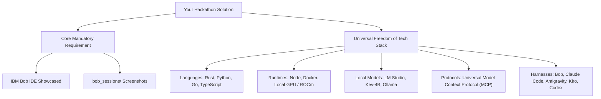
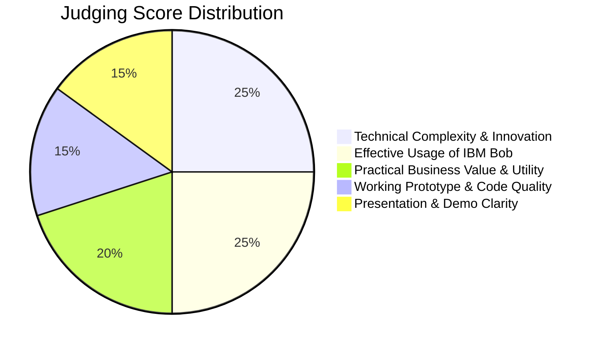

# IBM Bob 2.0 Hackathon: The Complete Builder's Guide

> **Official Event**: IBM Bob 2.0 Hackathon on [Lablab.ai](https://lablab.ai)  
> **Prize Pool**: **$12,000 USD**  
> **Duration**: 48 Hours  
> **Eligible Accounts Region**: `us-east` (Instance: `ibm-coding-challenge-uat`)  
> **Local Project Source**: [KevGate Architecture](ARCHITECTURE.md) | [Bob Sessions Evidence](bob_sessions/README.md)

---

## 📑 Table of Contents

1. [Quick Reference & Urgent Deadlines](#1-quick-reference--urgent-deadlines)
2. [The 3 Fatal Disqualification Rules (Zero Tolerance)](#2-the-3-fatal-disqualification-rules-zero-tolerance)
3. [Bobcoins Economics: The 40-Coin Budget](#3-bobcoins-economics-the-40-coin-budget)
4. [Authentication & Account Configuration](#4-authentication--account-configuration)
5. [Bob IDE vs. Bob Shell: Roles & Setup](#5-bob-ide-vs-bob-shell-roles--setup)
6. [Tech Stack Freedom: What You Can & Cannot Use](#6-tech-stack-freedom-what-you-can--cannot-use)
7. [The Mandatory `bob_sessions/` Deliverable](#7-the-mandatory-bob_sessions-deliverable)
8. [Submission Checklist & Deliverables](#8-submission-checklist--deliverables)
9. [Judging Criteria & How to Win](#9-judging-criteria--how-to-win)
10. [KevGate Strategy: How Our Project Aligns with the Judges](#10-kevgate-strategy-how-our-project-aligns-with-the-judges)

---

## 1. Quick Reference & Urgent Deadlines

| Milestone | Schedule / Details |
| :--- | :--- |
| **Duration** | 48 Hours |
| **Registration Cutoff** | Thursday, September 24 · 10:00 PM CEST / 4:00 PM ET |
| **Submission Deadline** | Sunday (Check exact timer on Lablab.ai dashboard) |
| **Prize Distribution** | **$12,000 Total Pool**<br>• 🥇 **1st Place**: $5,000<br>• 🥈 **2nd Place**: $3,000<br>• 🥉 **3rd Place**: $2,000<br>• 🎁 **Participant Bonus**: 20 × $100 rewards for verified submissions + feedback |
| **Required Deliverables** | 1. Public GitHub Repo<br>2. `bob_sessions/` directory with task consumption screenshots<br>3. 3–5 min Demo Video<br>4. Lablab.ai Submission Page Writeup |

---

## 2. The 3 Fatal Disqualification Rules (Zero Tolerance)

If your submission fails any of these three requirements, **it will be automatically disqualified before judging**:

### 🚫 Rule 1: IBM Bob IDE is Mandatory
* You are completely free to use auxiliary tools (Claude Code, Antigravity, OpenAI Codex, Kiro, local LLMs via LM Studio/Ollama), but **IBM Bob IDE must be showcased as a core component of your development workflow or final solution**.
* **Bob Shell alone is not sufficient** for the mandatory requirement. You must run and capture tasks inside **Bob IDE**.

### 🚫 Rule 2: The `bob_sessions/` Directory
* Your GitHub repository **must** include a folder named [`bob_sessions/`](bob_sessions/) containing clear `.png` screenshots of Bob IDE task session consumption summaries.
* Submissions lacking this folder are categorized as "Did not use Bob" and rejected automatically.

### 🚫 Rule 3: Strict Data Compliance (Bring Your Own Data)
* **Allowed**: Public datasets with explicit commercial-use licenses (Apache-2.0, MIT, CC-BY), synthetic data, open APIs.
* **Prohibited (Instant DQ)**:
  * ❌ Client / employer proprietary data.
  * ❌ Personal Identifiable Information (PII) of real individuals.
  * ❌ Unlicensed scraped social media data (Twitter/X, LinkedIn, Reddit, etc.).
  * ❌ Any data without documented commercial usage terms.

---

## 3. Bobcoins Economics: The 40-Coin Budget

Every participant account is allocated exactly **40 Bobcoins** at kickoff. Every prompt, code generation, reasoning pass, and subagent loop burns coins.

> [!CAUTION]
> **No top-ups are provided when you hit 100% usage.** Once your 40 Bobcoins are exhausted, Bob IDE will reject further API completions.

### Tactical Budgeting Strategies:
1. **Distribute across teammates**:
   * If you have multiple registered teammates, do not let one person execute all tasks. Divide project phases so each member utilizes their 40-coin allocation.
2. **Set cost caps in Bob Shell**:
   * When invoking tasks via terminal, use `--max-cost` and `--max-turns`:
     ```bash
     bob chat --auto-approve --trust --max-cost 2.0 --max-turns 20
     ```
3. **Use Local Models for High-Frequency Loops**:
   * Run local inference (e.g. Kev-4B in LM Studio on your RX 6600 XT) for pre-commit linting, diff triage, and AST checks to avoid burning expensive Bobcoins on trivial formatting or syntactic errors.
4. **Fallback Options**:
   * If coins deplete, IBM watsonx Prompt Lab (Granite 3.0 models) and watsonx Orchestrate remain accessible via IBM Cloud free-tier credentials.

---

## 4. Authentication & Account Configuration

### Step 1: IBMid Verification
* Ensure your IBMid email matches the **exact email address** used on Lablab.ai.
* Sign in at [bob.ibm.com](https://bob.ibm.com).

### Step 2: Switch to the Hackathon Instance (Critical!)
By default, Bob accounts may default to personal trial instances. You must explicitly target the hackathon tenant to use the 40 allocated Bobcoins:
1. Open Bob IDE → **Settings** (Gear icon) → **General**.
2. Under **Account / Instance**, confirm or switch to:
   * **Instance**: `ibm-coding-challenge-uat`
   * **Region**: `us-east`
3. If using the CLI / Bob Shell, export your API key generated from that specific instance:
   ```bash
   export BOB_API_KEY="your-api-key-from-ibm-coding-challenge-uat"
   ```

---

## 5. Bob IDE vs. Bob Shell: Roles & Setup

| Feature | Bob IDE (GUI) | Bob Shell (CLI) |
| :--- | :--- | :--- |
| **Form Factor** | Desktop IDE (Theia/Electron-based) | Terminal binary (`/home/agent/.local/bin/bob`) |
| **Hackathon Status** | **MANDATORY** (Evidence captured here) | **OPTIONAL / POWER TOOL** |
| **Best For** | Task execution, interactive diff inspection, capturing session screenshots | Fast CLI scripting, automation pipelines, headless task runs |

### Launching Bob Shell inside Orca / Headless Terminal
When running Bob in terminal windows, always pass these flags to prevent interactive blocking:
```bash
bob chat --auto-approve --trust --accept-license -w /home/agent/orca/IBM-hackathon
```
* `--auto-approve`: Bypasses tool approval prompts for bash commands and file writes.
* `--trust`: Prevents blocking on startup folder trust prompts.
* `--accept-license`: Automatically accepts IBM license agreements.
* `-w <path>`: Pins the working directory.

---

## 6. Tech Stack Freedom: What You Can & Cannot Use

You are **not** restricted to IBM-only software:



* **Frontend / Backend**: Any language (Python, TypeScript, Go, Rust, C++).
* **Architecture**: Standalone apps, libraries, developer tools, CLI utilities, MCP servers, web apps.
* **LLM Backends**: You can integrate local inference (LM Studio, vLLM), OpenAI, Anthropic, or watsonx Granite.
* **Cross-Agent Harnesses**: Tools like KevGate can be designed to serve Bob Shell, Claude Code, Kiro, and Antigravity via standard MCP.

---

## 7. The Mandatory `bob_sessions/` Deliverable

The judging panel verifies Bob usage by inspecting the [`bob_sessions/`](bob_sessions/) directory in your repository.

### How to Capture Verifiable Screenshots:
1. In Bob IDE, open the chat/task sidebar.
2. Click **Tasks** to open the task history.
3. Set the workspace filter to **All**.
4. Click the header of each task executed for your project to open the **Session Consumption Summary** (displays turn count, token usage, tool calls, and Bobcoins spent).
5. Capture a clear full-resolution PNG screenshot.
6. Name the files using the standard convention:
   ```text
   bob_sessions/<team_name>_task<XX>_<feature_name>_summary.png
   ```
   *Example*:
   * `bob_sessions/kevgate_task01_mcp_scaffold_summary.png`
   * `bob_sessions/kevgate_task02_diff_engine_summary.png`
   * `bob_sessions/kevgate_task03_benchmarks_summary.png`

> [!TIP]
> Capture your screenshots **incrementally** after finishing each milestone. Do not wait until the final hour before submission.

---

## 8. Submission Checklist & Deliverables

Before the submission deadline closes, complete every item:

- [ ] **GitHub Repository**:
  - [ ] Publicly accessible.
  - [ ] [`README.md`](README.md) with comprehensive setup instructions, architecture diagram, and demo flow.
  - [ ] [`ARCHITECTURE.md`](ARCHITECTURE.md) detailing technical design and workflow.
  - [ ] [`bob_sessions/`](bob_sessions/) directory containing at least 2–4 verified task session screenshots.
- [ ] **Demonstration Video**:
  - [ ] Length: **3 to 5 minutes** (Strict: avoid going over 5 minutes).
  - [ ] Uploaded to YouTube (Unlisted or Public) or Loom.
  - [ ] **Structure**:
    1. *The Problem* (30s): LLM coding agents burn tokens on bad diffs, security vulnerabilities, and runaway loops.
    2. *The Solution* (60s): Fast non-autoregressive decision gating (KevGate) via universal MCP.
    3. *Live Demo* (120s): Show Bob IDE / Bob Shell hitting the gate, catching bad code, and passing safe commits.
    4. *Business Impact & Tech Value* (30s): 10x token savings, local GPU execution, multi-harness compatibility.
- [ ] **Lablab.ai Submission Form**:
  - [ ] Project Title & Tagline.
  - [ ] Problem Statement & Solution description.
  - [ ] Link to public GitHub repository.
  - [ ] Link to demonstration video.
  - [ ] Technologies used (IBM Bob 2.0, MCP, Python, LM Studio, etc.).
- [ ] **Post-Submission**:
  - [ ] Complete the official participant feedback survey to qualify for the 20 × $100 reward pool.

---

## 9. Judging Criteria & How to Win

Judges evaluate submissions across 5 distinct dimensions:



1. **Effective Usage of IBM Bob (25%)**:
   * Does the project genuinely use Bob's capabilities (modes, subagents, tools, MCP, or shell)?
   * Are the `bob_sessions/` screenshots authentic and clear?
2. **Technical Complexity & Innovation (25%)**:
   * Does the project introduce a novel concept (e.g. non-autoregressive decision modeling, asymmetric risk gating)?
   * Is it technically challenging rather than a generic prompt wrapper?
3. **Practical Business Value (20%)**:
   * Does it solve a real developer pain point?
   * *For KevGate*: Reducing LLM token costs, preventing secret leaks, and automating code reviews solves a universal $100M+ industry issue.
4. **Working Prototype Quality (15%)**:
   * Does the code run? Is it documented with reproducible tests and CLI commands?
5. **Presentation & Pitch (15%)**:
   * Is the video concise, punchy, well-edited, and easy for non-technical judges to understand?

---

## 10. KevGate Strategy: How Our Project Aligns with the Judges

Our project, **KevGate**, is engineered to score near 100% across all 5 judging criteria:

| Hackathon Requirement | KevGate Implementation |
| :--- | :--- |
| **Bob Integration** | Implemented as a **Universal Model Context Protocol (MCP)** server natively loaded into Bob IDE and Bob Shell via `bob mcp add-json`. |
| **Token / Coin Conservation** | Directly addresses the 40-Bobcoin scarcity by inserting a 50ms local discriminator (Kev-4B) to block junk commits before Bob burns tokens. |
| **Cross-Harness Utility** | Works out-of-the-box not just in Bob, but in Claude Code, Antigravity, Kiro, Codex, and pre-commit git hooks. |
| **Verifiable Evidence** | Bob IDE is used to build, test, and run the benchmark suites, captured directly in [`bob_sessions/`](bob_sessions/). |
| **Edge Hardware Optimization** | Runs locally on consumer GPUs (AMD RX 6600 XT via LM Studio) without cloud API dependencies. |

---

*Keep this guide open as your operational checklist throughout the hackathon weekend.*
