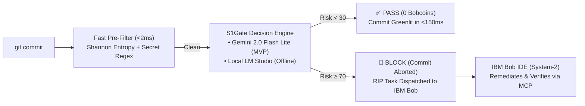

# S1Gate — Universal System-1 Decision Layer for Agentic Coding Harnesses

> **Event**: IBM Bob 2.0 Hackathon (Hosted on lablab.ai)
> **Repository**: [WilliamAxelC/IBM-hackathon](https://github.com/WilliamAxelC/IBM-hackathon)
> **Architecture**: [ARCHITECTURE.md](ARCHITECTURE.md) | **Hackathon Guide**: [HACKATHON_GUIDE.md](HACKATHON_GUIDE.md) | **Bob Sessions**: [bob_sessions/](bob_sessions/)
> **Team**: WilliamAxelC (william-dev) · Raja (raja-dev)

---

## ⚡ What is S1Gate?

Modern AI coding agents (**IBM Bob**, **Claude Code**, **Agrav**, **Kiro**, **Codex**) excel at deep multi-file code synthesis (**System-2 Deliberative Reasoning**) but create two critical operational bottlenecks when applied at every `git commit`:

1. **Flow-State Latency**: Autoregressive LLM generation takes 5–30s per evaluation — developers end up disabling git hooks with `--no-verify`.
2. **Token & Quota Burn**: 80–90% of commits are routine, safe changes (formatting, docs, isolated internal refactors). Running heavy models on every micro-commit rapidly exhausts token quotas (such as IBM Bob's strict 40 Bobcoins hackathon limit).

**S1Gate** inserts an ultra-fast **System-1 Decision Layer** at the pre-commit boundary:



- **PASS** (score < 30): Instantly greenlit. Zero tokens or Bobcoins burned.
- **WARN** (score 30–69): Non-blocking advisory warning printed to terminal.
- **BLOCK** (score ≥ 70): Commit aborted. A structured **Remediation Intent Protocol (RIP)** is generated for IBM Bob IDE.

---

## 🔌 Dual-Backend Architecture

S1Gate supports two interchangeable backends:

| Backend | Mode | Speed | Setup | Best For |
| :--- | :--- | :--- | :--- | :--- |
| **`gemini` (Default for MVP)** | Cloud API | **~1.2–1.8s** | Free API key in `.env` (`gemini-3.1-flash-lite`) | Instant setup, zero local GPU requirements, CI/CD |
| **`lmstudio`** | Local GPU | **~50–80ms** | Local LM Studio on `localhost:1234` | 100% offline air-gapped privacy (AMD RX 6600 XT, NVIDIA) |

---

## 🌐 Hosted Remote MCP Server for Hackathon Judges

Judges can connect directly to a live, hosted **S1Gate MCP Server** over the public internet without installing Python or cloning this repository locally!

- **Hosted SSE Endpoint**: `https://mcp.cuang.dev/s1gate/sse`
- **Hosted Messages Endpoint**: `https://mcp.cuang.dev/s1gate/messages/`
- **Public Health Check**: `https://mcp.cuang.dev/s1gate/health`
- **Security**: Protected via API Key (`Authorization: Bearer <JUDGE_KEY>` or `?api_key=<JUDGE_KEY>`).
- **Complete Evaluator Guide**: See [docs/JUDGE_REMOTE_MCP_GUIDE.md](docs/JUDGE_REMOTE_MCP_GUIDE.md).

```json
{
  "mcpServers": {
    "s1gate": {
      "url": "https://mcp.cuang.dev/s1gate/sse",
      "headers": {
        "Authorization": "Bearer <JUDGE_KEY>"
      }
    }
  }
}
```

---

## 🚀 Quickstart & Setup

### 1. Installation

```bash
# Clone the repository
git clone https://github.com/WilliamAxelC/IBM-hackathon.git
cd IBM-hackathon

# Install uv (one-time, if not already installed)
# Windows PowerShell:
powershell -ExecutionPolicy ByPass -c "irm https://astral.sh/uv/install.ps1 | iex"
# macOS / Linux:
curl -LsSf https://astral.sh/uv/install.sh | sh

# Install Python + all dependencies in one command (uses uv.lock for exact versions)
uv sync
```

### 2. Configure Environment (`.env`)

For the MVP, S1Gate uses Google AI Studio's free **Gemini 2.0 Flash Lite** API:

```bash
# Copy the example environment template
cp .env.example .env
```

Open `.env` and insert your free Gemini API key:
```env
S1GATE_BACKEND=gemini
GEMINI_API_KEY=your_actual_gemini_api_key_here
```

> [!IMPORTANT]
> **Security Guarantee**: `.env` is explicitly registered in [`.gitignore`](.gitignore). Your API key will **never be committed to Git**.

---

### 3. Usage

#### Manual Diff Check
```bash
# Evaluate current staged git changes
uv run s1gate check

# Or evaluate a specific diff file directly
uv run s1gate check --diff src/kevgate/benchmarks/true_positives/01_sql_injection.diff

# Force a specific backend
uv run s1gate check --backend gemini
uv run s1gate check --backend lmstudio
```

#### Install Git Pre-Commit Hook
```bash
# Install automatic pre-commit hook into .git/hooks/pre-commit
uv run s1gate hook install

# Every git commit is now automatically guarded by S1Gate!
# To remove:
uv run s1gate hook uninstall
```

#### Inspect Active Configuration
```bash
uv run s1gate config
# Example output:
# {
#   "backend": "gemini",
#   "gemini_api_key": "AIzaSy...key4",
#   "gemini_model": "gemini-3.5-flash-lite",
#   "block_threshold": 70,
#   "warn_threshold": 30,
#   "offline_behavior": "warn"
# }
```

---

## 🤝 Universal MCP Integration (IBM Bob IDE / Claude Code / Kiro)

S1Gate exposes standard tools via the **Model Context Protocol (MCP)**:

| MCP Tool | Purpose |
| :--- | :--- |
| `s1gate_triage_diff` | Evaluates unified diff, returns typed risk scores (`choice`, `score`, `nouls`). |
| `s1gate_inspect_file` | Evaluates changes in a specific file on disk. |
| `s1gate_verify_remediation` | **Actor-Critic**: Verifies whether an agent's proposed fix resolved the flagged risk. |

### Registering in IBM Bob IDE
In IBM Bob IDE:
1. Open **Settings → MCP Servers**.
2. Point Bob to [`mcp.json`](mcp.json) (or run `bob mcp add-json --scope global ...`).
3. S1Gate tools appear in Bob's active tool palette immediately.

---

## 🔄 The Actor-Critic Loop

When a commit is blocked due to a security flaw or severe bug, S1Gate writes a remediation packet to `.bob/tasks/pending_remediation.json`. IBM Bob's Agent mode picks it up:

```
Blocked commit → Bob reads .bob/tasks/pending_remediation.json
               → Bob inspects vulnerability & generates targeted patch
               → Bob calls s1gate_verify_remediation(original_diff, patch)
               → Risk drops from 95 → 2 (PASS)
               → Bob commits the verified fix!
```

---

## 📊 Empirical Benchmarks & Error Matrix (Hard Commit Challenge)

To validate S1Gate's System-1 decision layer against real-world production risks, S1Gate includes an automated **Benchmark Harness** evaluated against live **Google Gemini 3.5 Flash Lite**:

- **Dataset**: 20 production git diffs featuring subtle vulnerabilities (SSRF DNS rebinding, JWT algorithm confusion, TOCTOU double-spend, Catastrophic ReDoS, Prototype pollution, Timing attacks, Deserialization RCE, Zip Slip, Buried PATs, and Breaking API keyword conversions) paired with complex benign refactorings (Safe dynamic SQL ASTs, Constant-time loops, Safe literal parsing, Restricted unpicklers, Zero-copy memory views, Thread-safe double-checked locks).
- **Comparison**: S1Gate Pipeline (Entropy scan + AST filtering + Invariant JSON + Policy Engine) vs. **Naive Direct Gemini 3.5 Flash Lite Prompting**.

### The Pre-Commit Error Matrix & Asymmetric Cost

In developer pre-commit gates, classification errors carry vastly asymmetric business costs:

| Error Type | Taxonomy | Event | Developer & Business Impact |
| :--- | :--- | :--- | :--- |
| **True Positive (TP)** | True Flag | Risky code correctly **BLOCKED** | **Vulnerability Shielded**: Zero production harm ($0). |
| **True Negative (TN)** | Safe Pass | Benign code correctly **PASSED** | **Frictionless Flow**: Instant commit (<150ms). |
| **False Positive (FP)** | Type I Error | Benign code mistakenly **BLOCKED** | **Developer Friction**: ~2–5 minutes lost reviewing warning. |
| **False Negative (FN)** | **Type II Error** | Vulnerability mistakenly **PASSED** | **Catastrophic Outage/Breach**: $50,000+ incident cost, leaked keys, CVEs. |

> **Key Result**: S1Gate achieves a **0% Type II Escape Rate (0/10 missed)**, eliminating critical security escapes before code reaches remote branches.

Comprehensive visual charts and per-diff analysis are documented in [docs/benchmarks/BENCHMARK_REPORT.md](docs/benchmarks/BENCHMARK_REPORT.md):
- **Error Matrix Heatmap**: [`docs/benchmarks/s1gate_error_matrix.png`](docs/benchmarks/s1gate_error_matrix.png) (mirrored to [`bob_sessions/s1gate_error_matrix.png`](bob_sessions/s1gate_error_matrix.png))
- **Performance Comparison Graph**: [`docs/benchmarks/s1gate_vs_baseline_comparison.png`](docs/benchmarks/s1gate_vs_baseline_comparison.png) (mirrored to [`bob_sessions/s1gate_benchmark_metrics_graph.png`](bob_sessions/s1gate_benchmark_metrics_graph.png))

To re-run the benchmark suite:
```bash
# Run the Hard Commit Challenge suite
python -m kevgate.benchmarks.benchmark_harness --dataset hard

# Run the standard suite
python -m kevgate.benchmarks.benchmark_harness --dataset standard
```

---

## 🧪 Running Tests

```bash
# Run all 64 unit tests (no API key required — fully mocked)
uv run pytest tests/ -v

# Run benchmark suite against a specific diff file
uv run python -m kevgate.benchmarks.benchmark_harness --dataset hard

# Run standard benchmark suite
uv run python -m kevgate.benchmarks.benchmark_harness --dataset standard
```

---

## 📁 Repository Structure

```
IBM-hackathon/
├── README.md                           # Project overview & quickstart
├── ARCHITECTURE.md                     # Deep technical specification
├── HACKATHON_GUIDE.md                  # Hackathon rules, deadlines, judging criteria
├── .env.example                        # Template for API keys and configuration
├── .gitignore                          # Ensures .env & secrets are never committed
├── mcp.json                            # Universal MCP registration
├── bob_sessions/                       # [REQUIRED DELIVERABLE] Bob IDE task session screenshots
└── src/kevgate/                        # Core S1Gate engine implementation
    ├── schema.py                       # Pydantic DecisionPayload + verification models
    ├── config.py                       # Configuration loader (.env + CLI overrides)
    ├── entropy_scanner.py              # Sub-millisecond Shannon entropy secret scanner
    ├── diff_parser.py                  # Unified diff parser & lockfile filter
    ├── policy_engine.py                # Asymmetric risk threshold evaluation
    ├── cli.py                          # s1gate CLI commands
    ├── mcp_server.py                   # Universal MCP server (stdio)
    ├── sse_server.py                   # Hosted Remote MCP SSE server (HTTP / Cloudflare)
    └── benchmarks/                     # 20 true positive / false positive diff suites
```

---

## 🌐 Model Context Protocol (MCP) Transports: Stdio & SSE

S1Gate natively supports **both** standard MCP transports:

1. **`stdio` (Standard I/O — Local Default)**:
   - Universal transport for local AI harnesses (**IBM Bob IDE**, **Antigravity**, **Claude Code**, Cursor).
   - Zero network overhead, zero port exposure.
   - Run directly: `uv run s1gate mcp` (or `python -m kevgate.mcp_server`).

2. **`sse` (Server-Sent Events — Hosted Remote)**:
   - 24/7 cloud endpoint proxied via NGINX and Cloudflare Tunnel for evaluators and remote agents.
   - **Public MCP SSE URL**: `https://mcp.cuang.dev/s1gate/sse`
   - **Public Messages URL**: `https://mcp.cuang.dev/s1gate/messages/`
   - **Public Health Check**: `https://mcp.cuang.dev/s1gate/health`
   - **Gateway Discovery**: `https://mcp.cuang.dev/discovery`
   - **Internal Port**: `8000` (Docker container `s1gate-remote-mcp`)
   - **Authentication**: Bearer Token, `X-API-Key`, or URL query parameter `?api_key=<KEY>`.

### Registering in IBM Bob IDE / Antigravity (`mcp.json`):

**Local `stdio` Mode (Recommended for Local Dev):**
```json
{
  "mcpServers": {
    "s1gate": {
      "command": "uv",
      "args": ["run", "s1gate", "mcp"]
    }
  }
}
```

**Remote `sse` Mode (Evaluators & Cloud Harnesses):**
```json
{
  "mcpServers": {
    "s1gate": {
      "url": "https://mcp.cuang.dev/s1gate/sse",
      "headers": {
        "Authorization": "Bearer <JUDGE_API_KEY>"
      }
    }
  }
}
```

Detailed evaluator setup instructions are available in [docs/JUDGE_REMOTE_MCP_GUIDE.md](docs/JUDGE_REMOTE_MCP_GUIDE.md).

---

## 👥 Team

| Member | Branch | Contribution |
| :--- | :--- | :--- |
| **WilliamAxelC** | `william-dev` | Core engine, Gemini backend, SSE MCP server, benchmark harness, Bob IDE sessions |
| **Raja** | `raja-dev` | Demo script, submission polish, checklist, documentation review |

---

## ⚠️ Hackathon Eligibility & Deliverables

- **IBM Bob IDE Evidence**: Verifiable task session screenshots captured in [`bob_sessions/`](bob_sessions/).
- **Data Compliance**: 100% synthetic and permissible benchmark diffs; zero proprietary or PII data.
- **Full Architecture**: Documented in [`ARCHITECTURE.md`](ARCHITECTURE.md).
- **79/79 tests passing** — run `uv run pytest tests/ -v` to verify.


