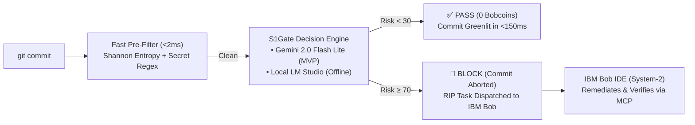

# S1Gate — Universal System-1 Decision Layer for Agentic Coding Harnesses

> **Event**: IBM Bob 2.0 Hackathon (Hosted on lablab.ai)  
> **Repository**: [WilliamAxelC/IBM-hackathon](https://github.com/WilliamAxelC/IBM-hackathon)  
> **Architecture**: [ARCHITECTURE.md](ARCHITECTURE.md) | **Hackathon Guide**: [HACKATHON_GUIDE.md](HACKATHON_GUIDE.md) | **Bob Sessions**: [bob_sessions/](bob_sessions/)

---

## ⚡ What is S1Gate?

Modern AI coding agents (**IBM Bob**, **Claude Code**, **Agrav**, **Kiro**, **Codex**) excel at deep multi-file code synthesis (**System-2 Deliberative Reasoning**) but create two critical operational bottlenecks when applied at every `git commit`:

1. **Flow-State Latency**: Autoregressive LLM generation takes 5–30s per evaluation — developers end up disabling git hooks with `--no-verify`.
2. **Token & Quota Burn**: 80–90% of commits are routine, safe changes (formatting, docs, isolated internal refactors). Running heavy models on every micro-commit rapidly exhausts token quotas (such as IBM Bob's strict 40 Bobcoins hackathon limit).

**S1Gate** inserts an ultra-fast **System-1 Decision Layer** at the pre-commit boundary:



- **PASS** (score < 30): Instantly greenlit. Zero tokens or Bobcoins burned.
- **WARN** (score 30–69): Non-blocking advisory warning printed to terminal.
- **BLOCK** (score ≥ 70): Commit aborted. A structured **Remediation Intent Protocol (RIP)** is generated for IBM Bob IDE.

---

## 🔌 Dual-Backend Architecture

S1Gate supports two interchangeable backends:

| Backend | Mode | Speed | Setup | Best For |
| :--- | :--- | :--- | :--- | :--- |
| **`gemini` (Default for MVP)** | Cloud API | **~100–150ms** | Free API key in `.env` | Instant setup, zero local GPU requirements, CI/CD |
| **`lmstudio`** | Local GPU | **~50–80ms** | Local LM Studio on `localhost:1234` | 100% offline air-gapped privacy (AMD RX 6600 XT, NVIDIA) |

---

## 🚀 Quickstart & Setup

### 1. Installation

```bash
# Clone the repository
git clone https://github.com/WilliamAxelC/IBM-hackathon.git
cd IBM-hackathon

# Create virtual environment and install dependencies
uv venv .venv
source .venv/bin/activate
uv pip install -e ".[dev]"
```

### 2. Configure Environment (`.env`)

For the MVP, S1Gate uses Google AI Studio's free **Gemini 2.0 Flash Lite** API:

```bash
# Copy the example environment template
cp .env.example .env
```

Open `.env` and insert your free Gemini API key:
```env
S1GATE_BACKEND=gemini
GEMINI_API_KEY=your_actual_gemini_api_key_here
```

> [!IMPORTANT]
> **Security Guarantee**: `.env` is explicitly registered in [`.gitignore`](.gitignore). Your API key will **never be committed to Git**.

---

### 3. Usage

#### Manual Diff Check
```bash
# Evaluate current staged git changes
s1gate check

# Or evaluate a specific diff file directly
s1gate check --diff tests/fixtures/sql_injection.diff
```

#### Install Git Pre-Commit Hook
```bash
# Install automatic pre-commit hook into .git/hooks/pre-commit
s1gate hook install

# Every git commit is now automatically guarded by S1Gate!
# To remove:
s1gate hook uninstall
```

#### Inspect Active Configuration
```bash
s1gate config
```

---

## 🤝 Universal MCP Integration (IBM Bob IDE / Claude Code / Kiro)

S1Gate exposes standard tools via the **Model Context Protocol (MCP)**:

| MCP Tool | Purpose |
| :--- | :--- |
| `s1gate_triage_diff` | Evaluates unified diff, returns typed risk scores (`choice`, `score`, `nouls`). |
| `s1gate_inspect_file` | Evaluates changes in a specific file on disk. |
| `s1gate_verify_remediation` | **Actor-Critic**: Verifies whether an agent's proposed fix resolved the flagged risk. |

### Registering in IBM Bob IDE
In IBM Bob IDE:
1. Open **Settings → MCP Servers**.
2. Point Bob to [`mcp.json`](mcp.json) (or run `bob mcp add-json --scope global ...`).
3. S1Gate tools appear in Bob's active tool palette immediately.

---

## 🔄 The Actor-Critic Loop

When a commit is blocked due to a security flaw or severe bug, S1Gate writes a remediation packet to `.bob/tasks/pending_remediation.json`. IBM Bob's Agent mode picks it up:

```
Blocked commit → Bob reads .bob/tasks/pending_remediation.json
               → Bob inspects vulnerability & generates targeted patch
               → Bob calls s1gate_verify_remediation(original_diff, patch)
               → Risk drops from 95 → 2 (PASS)
               → Bob commits the verified fix!
```

---

## 🧪 Running Tests

```bash
# Run unit tests
pytest tests/ -v

# Run benchmark suite (mock mode)
pytest src/kevgate/benchmarks/ --mock -v
```

---

## 📁 Repository Structure

```
IBM-hackathon/
├── README.md                           # Project overview & quickstart
├── ARCHITECTURE.md                     # Deep technical specification
├── HACKATHON_GUIDE.md                  # Hackathon rules, deadlines, judging criteria
├── .env.example                        # Template for API keys and configuration
├── .gitignore                          # Ensures .env & secrets are never committed
├── mcp.json                            # Universal MCP registration
├── bob_sessions/                       # [REQUIRED DELIVERABLE] Bob IDE task session screenshots
└── src/kevgate/                        # Core S1Gate engine implementation
    ├── schema.py                       # Pydantic DecisionPayload + verification models
    ├── config.py                       # Configuration loader (.env + CLI overrides)
    ├── entropy_scanner.py              # Sub-millisecond Shannon entropy secret scanner
    ├── diff_parser.py                  # Unified diff parser & lockfile filter
    ├── policy_engine.py                # Asymmetric risk threshold evaluation
    ├── cli.py                          # s1gate CLI commands
    ├── mcp_server.py                   # Universal MCP server (stdio)
    └── benchmarks/                     # 20 true positive / false positive diff suites
```

---

## ⚠️ Hackathon Eligibility & Deliverables

- **IBM Bob IDE Evidence**: Verifiable task session screenshots captured in [`bob_sessions/`](bob_sessions/).
- **Data Compliance**: 100% synthetic and permissible benchmark diffs; zero proprietary or PII data.
- **Full Architecture**: Documented in [`ARCHITECTURE.md`](ARCHITECTURE.md).
