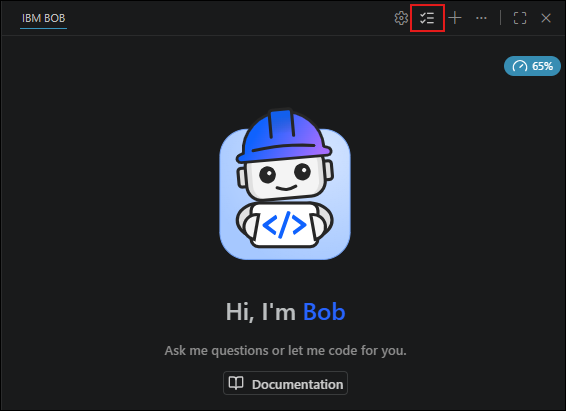
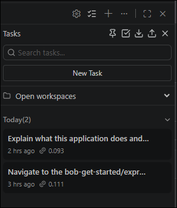
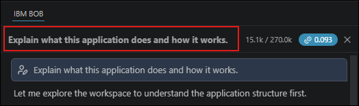
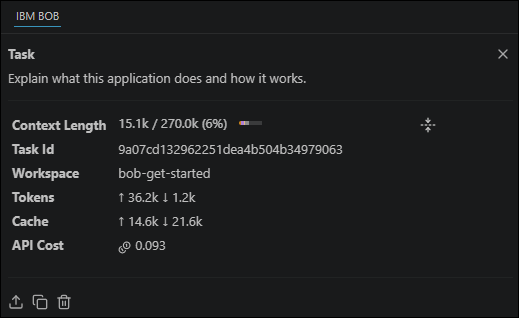

# Bob Task Session Summaries (`bob_sessions/`)

> [!CAUTION]
> **MANDATORY SUBMISSION DELIVERABLE**: Every participant/team must upload their Bob IDE task session consumption summary screenshots to this `bob_sessions/` directory. Submissions lacking this folder and screenshots **will not be eligible for judging**.

---

## Overview

In the **IBM Bob 2.0 Hackathon**, the `bob_sessions` folder serves as the official, verifiable proof of IBM Bob IDE usage. 

As stated in the [Hackathon Guide](../docs/HACKATHON_GUIDE.md#upload-bob-task-session-summary) and the [Kickoff Announcement](../docs/KICKOFF_ANNOUNCEMENT.md):
> *"Every participant must upload their Bob IDE task session summary screenshots to a folder called `bob_sessions` in your final code repository. It's a required deliverable and it's your evidence of Bob usage... Do this as you go, not at 11 PM on Sunday!"*

---

## Step-by-Step Instructions: How to Capture Task Summaries

### Step 1: Open Tasks in Bob IDE
In your Bob IDE’s chat interface, click the **Tasks** icon to display the task list.

  
*Figure 20: Selecting Tasks in Bob IDE chat interface*

---

### Step 2: Select the Relevant Project Task & Workspace
Select a task from the list that is relevant to your project submission. The selected task will open in the chat panel.  
- Confirm that you are in the correct project workspace.
- If your submission involves tasks from multiple workspaces, select **All** to view tasks across all relevant workspaces.

  
*Figure 21: Workspace filter set to All*

---

### Step 3: Open the Task Session Consumption Summary
Click on the **task header** at the very top of the chat panel. A detailed **task session consumption summary** dropdown will be displayed showing tokens, model usage, tool executions, and Bobcoin consumption.

  
*Figure 22: Clicking the task header to display consumption summary*

---

### Step 4: Capture & Save PNG Screenshot
1. Take a screenshot of the entire task session consumption summary modal.
2. Save the file in **PNG format** for optimal legibility.
3. Save directly into this folder: `bob_sessions/`.

  
*Figure 23: Example task session consumption summary screenshot*

---

## 🏷️ File Naming Convention

All screenshots in this folder must adhere to the standardized naming structure:

```
<team_name>_task<XX>_<short_task_description>_summary.png
```

### Examples:
- `teamalpha_task01_repo_scaffolding_summary.png`
- `teamalpha_task02_login_flow_summary.png`
- `teamalpha_task03_api_endpoints_summary.png`
- `teamalpha_task04_unit_tests_summary.png`
- `teamalpha_task05_deployment_ci_summary.png`

---

## 📋 Task Session Log Tracker

Use the table below to track all recorded sessions as your team completes development tasks:

| Task # | File Name | Workspace | Description / Feature | Captured By | Bobcoins / Consumption | Status |
| :---: | :--- | :--- | :--- | :--- | :--- | :---: |
| 01 | `<team>_task01_<desc>_summary.png` | Workspace 1 | Initial architecture & /init | — | — | ⏳ Pending |
| 02 | `<team>_task02_<desc>_summary.png` | Workspace 1 | Core workflow implementation | — | — | ⏳ Pending |
| 03 | `<team>_task03_<desc>_summary.png` | Workspace 1 | Agent Mode / Subagent task | — | — | ⏳ Pending |
| 04 | `<team>_task04_<desc>_summary.png` | Workspace 1 | Automated testing / validation | — | — | ⏳ Pending |
| 05 | `<team>_task05_<desc>_summary.png` | Workspace 1 | Final review & documentation | — | — | ⏳ Pending |

---

## ⚠️ Final Submission Checklist
Before submitting the project repository URL:
- [ ] Ensure `bob_sessions/` contains valid PNG screenshots for **every task** showcased in the submission.
- [ ] Verify that screenshots clearly show task consumption metrics and task headers.
- [ ] Confirm filenames match the `<team_name>_task<XX>_<description>_summary.png` standard.
- [ ] Check that `bob_sessions/` is committed and pushed to remote `main` branch.
