# IBM Bob 2.0 Hackathon Guide

> **Theme**: *Build with purpose using IBM Bob 2.0*  
> **Original Source URL**: [IBM Bob 2.0 Hackathon Guide](https://lablab-ibm-bob-2-hackathon-guide.s3.us.cloud-object-storage.appdomain.cloud/index.html)  
> **Anchor Reference**: [A Note on Using Other Technologies](https://lablab-ibm-bob-2-hackathon-guide.s3.us.cloud-object-storage.appdomain.cloud/index.html#a-note-on-using-other-technologies)  
> **Challenge Deliverable Requirement**: Task session summary screenshots must be saved in the `bob_sessions/` folder in your project repository.

---

## Quick Navigation / Table of Contents

- [The Hackathon Expectation](#the-hackathon-expectation)
  - [A note on using other technologies](#a-note-on-using-other-technologies)
  - [A note on data sets before you begin](#a-note-on-data-sets-before-you-begin)
- [Set Up IBM Bob Account](#set-up-ibm-bob-account)
  - [Confirm your hackathon IBM Bob account](#confirm-your-hackathon-ibm-bob-account)
  - [Bobcoins](#bobcoins)
- [Working with IBM Bob](#working-with-ibm-bob)
  - [1. Bob IDE](#1-bob-ide)
    - [Install Bob IDE](#install-bob-ide)
    - [Sign into Bob IDE](#sign-into-bob-ide)
    - [Best practices](#best-practices)
    - [Bob IDE features and configuration](#bob-ide-features-and-configuration)
    - [Bob IDE hands-on exercises](#bob-ide-hands-on-exercises)
  - [2. Bob Shell (Optional)](#2-bob-shell-optional)
    - [Install Bob Shell](#install-bob-shell)
    - [Authentication](#authentication)
    - [Start an interactive session](#start-an-interactive-session)
    - [Start a non-interactive session](#start-a-non-interactive-session)
    - [Bob Shell configuration](#bob-shell-configuration)
    - [Bob Shell tools](#bob-shell-tools)
    - [Bob Shell features](#bob-shell-features)
    - [Bob Shell usage examples](#bob-shell-usage-examples)
  - [Upload Bob task session summary (REQUIRED DELIVERABLE)](#upload-bob-task-session-summary)
- [Appendix: Example Use Cases](#appendix-example-use-cases)
- [Official IBM Bob Documentation Links](#official-ibm-bob-documentation-links)

---

## The hackathon expectation

In this hackathon, you will design and build a **working prototype** using **IBM Bob IDE**, aligned to the following theme:

**Build with purpose using IBM Bob 2.0**

Create a solution that improves a specific developer workflow, such as onboarding, debugging, code review, testing, application maintenance, or release and deployment processes. Start by clearly defining a problem where time, effort, or errors are too high today. Then, using IBM Bob 2.0, build a working prototype on a real or sample project that demonstrates a full solution to improve the specified workflow. Leverage features like Agent mode, parallel tasks, subagents, and document understanding to manage and improve multiple steps, not just assist with coding. Clearly demonstrate impact by showing how your solution increases productivity, reduces manual effort, errors, and rework, or significantly shortens the time required to complete tasks.

Refer to [example use cases](#appendix-example-use-cases) to help you brainstorm ideas for building a solution.

> [!IMPORTANT]
> Participants are required to upload all relevant **Bob IDE task session summary screenshots** to their code repository as evidence of Bob usage. Learn [how to upload task session summary](#upload-bob-task-session-summary).

Participants may also **optionally** use the following watsonx products:

- **IBM watsonx Orchestrate** – a no-code and low-code platform designed to orchestrate AI agents across business workflows. With watsonx Orchestrate, you can create, deploy, and manage intelligent agents and assistants that automate tasks, streamline processes, and enhance productivity.
- **IBM watsonx.ai** – a powerful AI studio that supports the development of agentic AI solutions using a wide range of foundation models. Through the Prompt Lab, participants can experiment with IBM’s Granite models and other leading models to create agents that understand and respond to natural language. IBM watsonx.ai can also serve as an inference provider for your agents, allowing them to generate responses, make decisions, and interact with users or systems intelligently.

#### A note on using other technologies

You may use any framework or technology to build your solution as long as you adhere to the product usage policies. However, to be eligible for judging, your solution must showcase **IBM Bob IDE** as a core component.

#### A note on data sets before you begin

Participants are required to bring their own datasets to build the solution aligning to your use case. As you collect data for your project, you’ll want to use best practices. Here are helpful tips:

- Participants are responsible for ensuring data is compliant.
- Data from public websites may be used, if the terms allow for commercial use, but please keep a list of the websites you use.
- Do not use data or assets containing company confidential data, or any other data without permission from the data owner. Participants are responsible for getting approval.
- Do not use any client data.
- Do not use any data containing personal information (PI).
- Do not use data obtained from social media.

## Set up IBM Bob account

To access and use the hackathon-provisioned IBM Bob account, participants must be registered for the hackathon.

> [!IMPORTANT]
> If you already have access to Bob through your personal account, please use the hackathon-provisioned Bob account for this event and to avoid consuming usage on your personal account.

### Confirm your hackathon IBM Bob account

At the start of the hackathon, all registered members will receive an email invite to join the **hackathon-provisioned Bob account**. Follow the steps below to confirm your account:

1. Check the email inbox you used to register for the hackathon and open the email invite you received from the IBM Bob team about joining your hackathon-provisioned Bob account. To confirm you have the correct email, look for:

- You have been added as a team member to **ibm-hackathon-xxxx**

 > [!NOTE]
 > The team member reference mentioned in the email does not mean that you have been added to a team for this hackathon. It is simply terminology used as part of the account enablement process through an Enterprise account. Participants who wish to join or form a team must do so through the supported hackathon platforms.

Please check your Junk/Spam folders if you cannot find the email in your inbox. You can also quickly search for “IBM Bob” to locate the email.

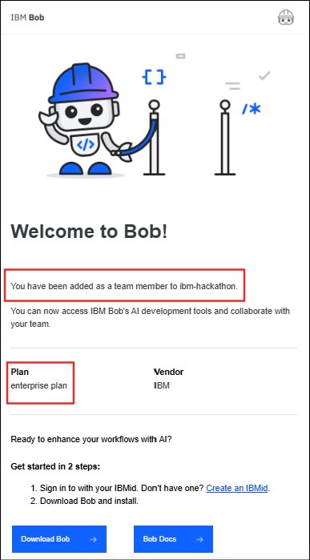

*Figure 2: Hackathon IBM Bob invitation email with team member assignment (ibm-hackathon-xxxx)*

1. [Create an IBMid](https://www.ibm.com/docs/en/storage-defender/base?topic=in-creating-ibmid) if you have not created one yet. IBMid is required to access Bob.

#### Bobcoins

Each interaction with Bob's AI capabilities consumes Bobcoins. For this hackathon, **40 Bobcoins** will be automatically applied to your hackathon-provisioned **IBM Bob account**. These Bobcoins are intended to be sufficient for designing and building a compelling proof-of-concept submission.

It is recommended that you plan ahead with your teammates to divide tasks so that you can make full use of the total Bobcoins allocated across all team members. Once your Bobcoin usage reaches **100% usage**, **no additional Bobcoins** **will be provided** as part of the hackathon. You may still continue working on your solution and final submission. For example, consider leveraging the optional watsonx technologies enabled for this hackathon.

Follow [Bob best practices](#best-practices) to use the tool effectively and efficiently.

You can monitor your Bobcoin usage in Bob IDE or [Admin dashboard](https://bob.ibm.com/admin/subscription):

- In your Bob IDE, select the **Settings** icon and the **Settings** tab will open.

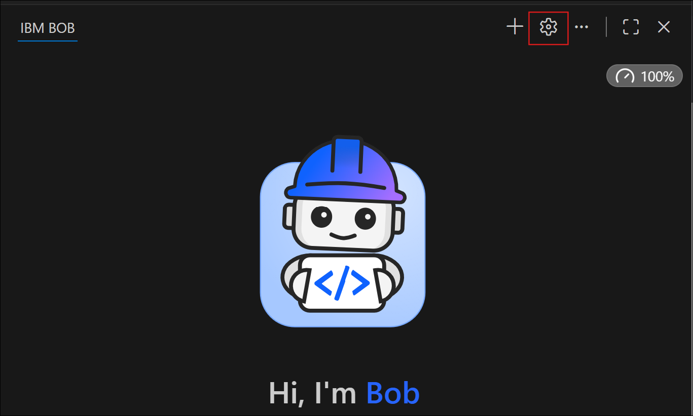

*Figure 3: Bob IDE Settings icon location*

- Under the **General** section, you can view your Bobcoin usage. If you have access to multiple Bob accounts, ensure that you select the hackathon provisioned instance named **ibm- coding-challenge-uat (region: us-east)**.

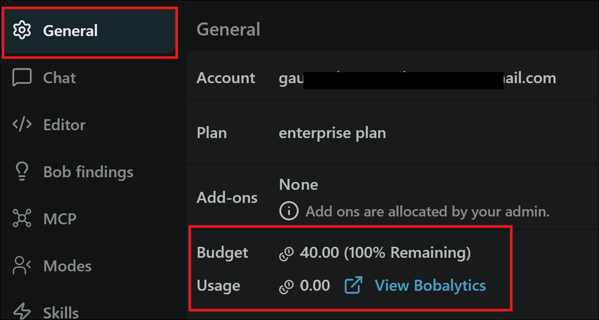

*Figure 4: Account settings showing Bobcoin usage and selecting ibm-coding-challenge-uat instance (region: us-east)*

> [!NOTE]
> The team name reference mentioned in the settings does not mean that you have been added to a team for this hackathon. It is simply terminology used as part of the account enablement process through an Enterprise account. Participants who wish to join or form a team must do so through the supported hackathon platforms.

### Working with IBM Bob

To participate in the hackathon, you must install and use **Bob IDE**. You may also optionally use **Bob Shell**.

1. [Bob IDE](#1-bob-ide) (Required)
2. [Bob Shell](#2-bob-shell-optional) (Optional)

> [!IMPORTANT]
> You must use **Bob IDE** for this hackathon. As part of your submission, you will be required to upload your [**Bob task session summary**](#upload-bob-task-session-summary) as evidence of Bob usage.

### 1. Bob IDE

Install the Bob IDE, sign into your Bob hackathon account, and start building your solution with Bob.

#### Install Bob IDE

Follow the [Bob IDE installation instructions](https://bob.ibm.com/docs/ide/getting-started/install).

> [!IMPORTANT]
> IDE v1.0.3 and v2.0.0 will stop working on September 30, 2026.

- If you are on v1.0.3, you must upgrade to the latest v2.0.x release.
- If you are on v2.0.0, you must upgrade to v2.0.2 or later.

#### Sign into Bob IDE

To use Bob IDE after installing it, you have to sign in to Bob using your hackathon registration email.

> [!IMPORTANT]
> An IBMid is required to authenticate. If you do not have one, see [Create an IBMid](https://www.ibm.com/account/reg/us-en/signup?formid=urx-19776) to create one for your hackathon registered email.

- Open your Bob IDE and select the **Log in to Bob** button on the IDE.

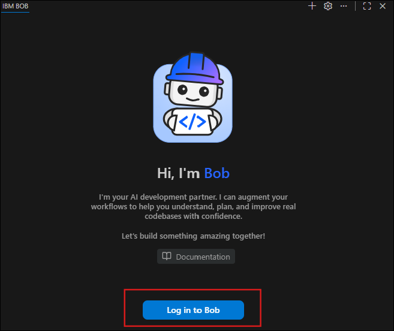

*Figure 5: Bob IDE "Log in to Bob" authentication button*

- Follow and complete the IBMid authentication process on your browser. Once authentication is complete, Bob chat interface will be displayed for you to get started.

*Figure 6: Bob chat interface displayed after successful IBMid login*

- **Important**: If you have access to multiple Bob accounts, ensure that you select the hackathon provisioned instance named **ibm- coding-challenge-uat (region: us-east)** to avoid consuming Bobcoins from your personal account. To switch to hackathon-provisioned account, select the **Settings** icon in the Bob IDE and it will open the Settings tab. Under General, you can switch the team to **ibm-coding-challenge- uat (region: us-east)** instance.

> [!NOTE]
> The team name reference mentioned in the settings does not mean that you have been added to a team for this hackathon. It is simply terminology used as part of the account enablement process through an Enterprise account. Participants who wish to join or form a team must do so through the supported hackathon platforms.

*Figure 7: Enterprise account instance selector in Bob IDE General Settings*

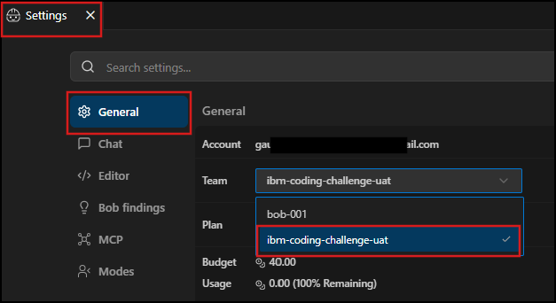

*Figure 8: Firewall and network troubleshooting configuration*

> [!NOTE]
> If you experience network issues with outbound traffic, you might need to configure your firewall settings. For more information, see [Configuring firewall rules for Bob](https://bob.ibm.com/docs/ide/troubleshooting/ts-firewall-rules).

#### Best practices

Follow the [best practices guidelines](https://bob.ibm.com/docs/ide/getting-started/best-practices) to get the most out of your experience with Bob.

#### Bob IDE features and configuration

Explore Bob IDE features and their configuration to enhance your experience working with Bob and solution building.

- [Chat interface](https://bob.ibm.com/docs/ide/features/chat-interface)

Bob IDE's chat interface is your primary workspace where you use natural language prompts, slash commands, and auto-approval for AI-assisted coding workflows. Learn more about [the chat interface and its components](https://bob.ibm.com/docs/ide/features/chat-interface).

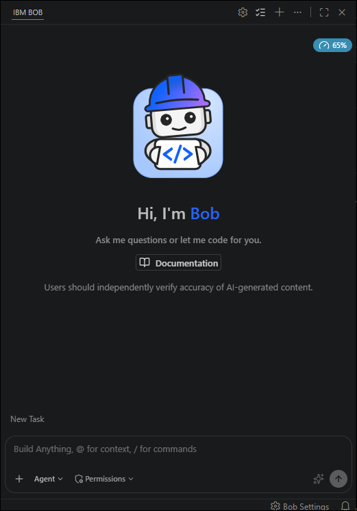

*Figure 9: Bob IDE chat interface components and prompt input*

- [Modes](https://bob.ibm.com/docs/ide/features/modes)

Modes are specialized personas that tailor Bob's behavior for your specific tasks. Each mode offers different capabilities and access levels to help you accomplish particular goals more efficiently. Learn more about [modes and their usage](https://bob.ibm.com/docs/ide/features/modes).

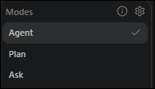

*Figure 10: Modes selector in Bob IDE*

- [Custom modes](https://bob.ibm.com/docs/ide/configuration/custom-modes)

Tailor Bob's behavior for specific tasks or workflows by creating custom modes. You can make modes global (available across all projects) or project-specific. Learn more about [subagents](https://bob.ibm.com/docs/ide/features/subagents).

- [Subagents](https://bob.ibm.com/docs/ide/features/subagents)

Learn how Bob uses subagents to handle focused, self-contained tasks in isolated contexts without polluting the main conversation. Learn more about [custom modes and its configuration](https://bob.ibm.com/docs/ide/configuration/custom-modes).

- [Auto-approve](https://bob.ibm.com/docs/ide/features/auto-approving-actions)

Auto-approve actions in Bob IDE eliminate repetitive prompts but increase security risks. Learn safe configuration practices for read, write, and execute permissions. Learn more about [auto-approve and its configuration](https://bob.ibm.com/docs/ide/features/auto-approving-actions).

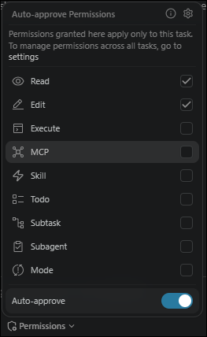

*Figure 11: Auto-approve permissions configuration panel*

- [Custom rules](https://bob.ibm.com/docs/ide/configuration/rules)

Custom rules influence how Bob responds to your requests, aligning output with your specific preferences and project requirements. You can control coding style, documentation approach, and decision-making processes. Learn more about [custom rules and its configuration](https://bob.ibm.com/docs/ide/configuration/rules).

- [MCP servers](https://bob.ibm.com/docs/ide/configuration/mcp/mcp-in-bob)

The Model Context Protocol (MCP) extends Bob's capabilities by connecting to external tools and services. This guide shows you how to configure, manage, and use MCP servers with Bob. Learn more about [MCP server configuration with Bob](https://bob.ibm.com/docs/ide/configuration/mcp/mcp-in-bob).

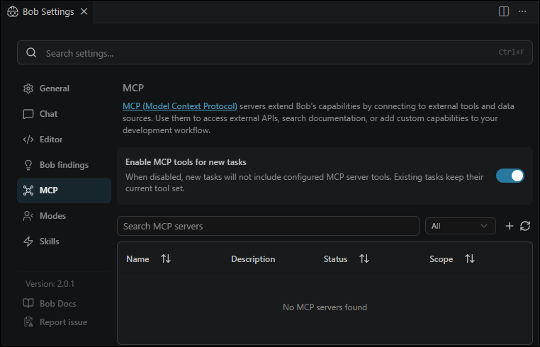

*Figure 12: MCP server configuration interface in Bob IDE*

- [Ignoring files](https://bob.ibm.com/docs/ide/configuration/bobignore)

Control which files Bob can access by creating a `.bobignore` file in your project. Learn more about [Ignoring files](https://bob.ibm.com/docs/ide/configuration/bobignore).

- [Context mentions](https://bob.ibm.com/docs/ide/features/context-mentions)

Context mentions let you reference specific elements of your project directly in your conversations with Bob. By using the @ symbol, you can point Bob to files, folders, problems, and other project components, enabling more accurate and efficient assistance. Learn more about [context mentions](https://bob.ibm.com/docs/ide/features/context-mentions).

- [Security guidelines](https://bob.ibm.com/docs/ide/security/bob-security-guidance)

Bob has capabilities for coding and system interaction. To use safely, follow the [security guidelines](https://bob.ibm.com/docs/ide/security/bob-security-guidance).

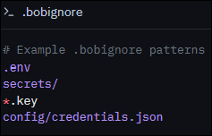

*Figure 13: Security rules and guidance configuration*

- [Bob tips](https://bob.ibm.com/docs/ide/features/bob-tips)

Bob tips detects code quality issues in real-time with AI-powered refactoring suggestions for complex functions. Reduce technical debt as you code. Learn more about [Bob tips and findings](https://bob.ibm.com/docs/ide/features/bob-tips).

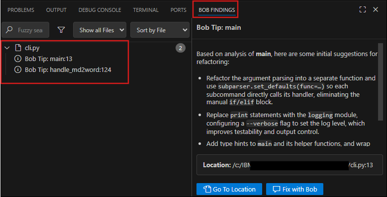

*Figure 14: Bob tips real-time code quality findings and refactoring suggestions*

- [Rollback](https://bob.ibm.com/docs/ide/features/rollback)

Automatically version workspace files during AI tasks. Safely explore AI suggestions and experiment with changes, and easily recover from unwanted changes. Learn more about [Rollback](https://bob.ibm.com/docs/ide/features/rollback).

- [Code actions](https://bob.ibm.com/docs/ide/features/code-actions)

Access Bob's AI-powered code actions that provide quick fixes, refactorings, and code explanations directly in the Bob IDE through lightbulb icons and context menus. Learn more about [utilizing code actions](https://bob.ibm.com/docs/ide/features/code-actions).

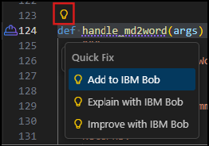

*Figure 15: AI-powered code actions and context menu suggestions*

- [Code reviews](https://bob.ibm.com/docs/ide/features/code-reviews)

Use the built-in Review workflow to get AI-powered code reviews directly in your IDE. Bob analyzes changes and flags potential issues before you commit your work. Learn more about [code reviews and its usage](https://bob.ibm.com/docs/ide/features/code-reviews).

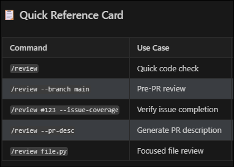

*Figure 16: Built-in code review workflow flagging issues before commit*

- [Commit messages](https://bob.ibm.com/docs/ide/features/commit-messages)

Generate meaningful commit messages automatically with Bob. Save time, maintain consistency, and follow conventional commit standards with AI assistance. Learn more about [commit message and its usage](https://bob.ibm.com/docs/ide/features/commit-messages).

- [Pull requests](https://bob.ibm.com/docs/ide/features/pull-requests)

Bob can generate pull requests (PRs) and PR descriptions directly from your IDE, streamlining your development workflow and saving time. Learn more about [pull requests and its usage](https://bob.ibm.com/docs/ide/features/pull-requests).

- [Enhance prompt](https://bob.ibm.com/docs/ide/features/enhance-prompt)

Improve your prompts before sending them to Bob. Click the sparkles icon in the chat input to automatically refine your request, making it clearer, more specific, and more likely to yield better results. Learn more about [enhancing prompts](https://bob.ibm.com/docs/ide/features/enhance-prompt).

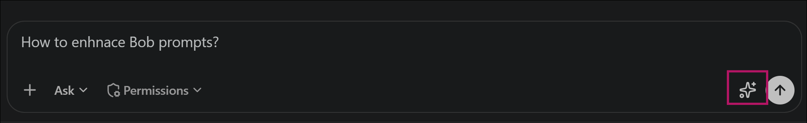

*Figure 17: Enhancing prompts using the sparkles icon*

- [Literate coding](https://bob.ibm.com/docs/ide/features/literate-coding)

Write code with AI assistance directly in your editor using natural language instructions right where the code should go. Bob generates the implementation in context with inline diffs. Learn more about [literate coding and its usage](https://bob.ibm.com/docs/ide/features/literate-coding).

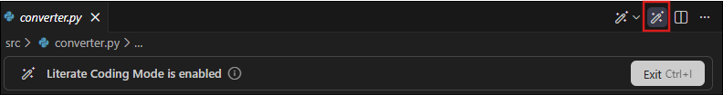

*Figure 18: Literate coding with inline natural language diffs*

- [Skills](https://bob.ibm.com/docs/ide/features/skills)

Create reusable instruction sets for specialized workflows. Define custom workflows, add supporting files, and teach Bob specialized tasks for consistent results. Learn more about [skills and its usage](https://bob.ibm.com/docs/ide/features/skills).

#### Bob IDE hands-on exercises

Try the quick start hands-on exercises for sample use cases to get started with using Bob.

> [!IMPORTANT]
> You must use the [hackathon-provisioned IBM Bob account](#confirm-your-hackathon-ibm-bob-account) to avoid usage on your personal Bob account, if you have one.

- [**Bob exercises**](#bob-ide-hands-on-exercises)

Quick hands-on exercises to learn how to use IBM Bob in the IDE for understanding code, refactoring, and automating everyday development tasks.

- [**Bob and watsonx Orchestrate exercises**](#bob-ide-hands-on-exercises)

Hands on exercises that show how IBM Bob and watsonx Orchestrate work together to design, build, and run agent-based workflows.

**Bob exercises**:

- [Quickstart exercise](https://bob.ibm.com/docs/ide/getting-started/quickstart)

Use IBM Bob to build a web UI for an existing Node.js Express API and run it in Docker, using modes, the approval workflow, and agentic iteration.

- [Travel demo app](https://bob.ibm.com/docs/ide/getting-started/tutorials/introduction)

Get started with IBM Bob and the Galaxium Travels demo app by learning the tutorial flow, setup requirements, and application architecture.

- [Build agents with Bob /init](https://bob.ibm.com/docs/ide/getting-started/tutorials/start-a-project)

Give Bob persistent project context across conversations and modes with /init, which automatically generates AGENTS.md files.

- [Create a commit and pull request with Bob](https://bob.ibm.com/docs/ide/tutorials/create-commit-and-pr)

Use Bob to create a branch, stage changes, generate a commit message, push to your repository, and open a pull request.

- [Generate code from comments](https://bob.ibm.com/docs/ide/getting-started/tutorials/generate-code-from-comments)

Use literate coding to have Bob generate code from natural language comments, where Bob helps you write precise, context-aware code modifications directly in your editor.

- [Plan and implement complex features](https://bob.ibm.com/docs/ide/getting-started/tutorials/partner-with-a-coding-agent)

Learn how to use the agentic chat sidebar to employ a Plan mode and Code mode workflow, where Bob plans complex features end-to-end and then implements them autonomously across your full codebase.

- [Standardize Bob's behavior](https://bob.ibm.com/docs/ide/getting-started/tutorials/standardize-bobs-behavior)

Standardize Bob's behavior across your team using project-level rules files that tell Bob to document its code and remember its previous actions.

- [Add a custom mode](https://bob.ibm.com/docs/ide/getting-started/tutorials/add-bob-capabilities)

Extend Bob's job capabilities by creating a custom product-manager mode with a tailored role definition, behavioral instructions, and deterministic tool access constraints.

- [Create a new context window](https://bob.ibm.com/docs/ide/getting-started/tutorials/context-window)

Manage Bob's context window to preserve memory, control cost, and maintain output quality during complex or long-running conversations.

- [Modernize a Node.js application](https://bob.ibm.com/docs/ide/tutorials/modernize-nodejs-express-api)

Learn to use IBM Bob for application modernization by upgrading a Node.js Express API from version 16 to 22. Try AI-assisted development with modes, approvals, and literate coding in this hands-on tutorial.

- [Inspect an unfamiliar codebase](https://bob.ibm.com/docs/ide/tutorials/inspect-a-codebase)

Use IBM Bob to rapidly understand an unfamiliar application, such as its purpose, project structure, architecture, tech stack, key components, test coverage, and deployment model. You can do this without relying on outdated documentation or waiting for teammates.

- [Generate architecture diagrams](https://bob.ibm.com/docs/ide/tutorials/generate-architecture-diagrams)

Use IBM Bob to analyze the Galaxium Travels codebase and generate Mermaid UML class diagrams, sequence diagrams, and use case diagrams. Learn how to use context mentions in Ask mode to explore code and Agent mode to save the results to your repository.

- [Audit code and generate reports](https://bob.ibm.com/docs/ide/tutorials/audit-code)

Use IBM Bob to create a reusable security audit skill, scan an application against OWASP ASVS requirements, and generate SARIF and OSCAL reports that developers and AI agents can act on.

- [Generate secure code with an actor-critic workflow](https://bob.ibm.com/docs/ide/tutorials/generate-secure-code)

Use IBM Bob to configure security rules and apply an actor-critic pattern to generate Python code that satisfies security frameworks before it reaches a static analysis tool.

**Bob and watsonx Orchestrate exercises**:

- [Using IBM Bob to build watsonx Orchestrate agents and MCP tools](https://developer.ibm.com/tutorials/build-agents-mcp-tools-watsonx-orchestrate-using-bob/)

A hands-on guide for automating the full process of building and deploying an agentic workflow using IBM Bob.

- [Build agentic workflows programmatically on watsonx Orchestrate using IBM Bob](https://developer.ibm.com/tutorials/build-programmatic-agentic-workflows-watsonx-orchestrate-bob/)

A hands-on guide for creating automated invoice-processing agentic workflows using IBM Bob to generate code, tools, and configuration for watsonx Orchestrate.

- [Turn BPMN diagrams into production‑ready agents with Bob skills and watsonx Orchestrate](https://developer.ibm.com/tutorials/bpmn-to-agents-bob-skills-watsonx-orchestrate/)

A hands-on guide for using Bob skills to transform BPMN process models into SOP‑driven, fully tested, and deployable watsonx Orchestrate agents with best‑practice workflows, tools, and automation patterns.

### 2. Bob Shell (Optional)

Bob Shell brings IBM Bob's AI capabilities to your command line. Bob Shell delivers the same context awareness and reasoning-focused approach from IBM Bob but optimized for shell environments and automated processes.

#### Install Bob Shell

Follow the [Bob Shell installation instructions](https://bob.ibm.com/docs/shell/getting-started/install-and-setup).

> [!IMPORTANT]
> **Upgrading from Bob Shell 1.0.x**

Bob Shell 2.0.0 requires a fresh install. Currently there is no automated upgrade path from 1.0.x. Your existing settings and configurations will be preserved during the install.

#### Authentication

Bob Shell uses the same login entry point as all other Bob clients: bob.ibm.com/login. Learn more about [Bob Shell authentication](https://bob.ibm.com/docs/shell/getting-started/install-and-setup#authentication).

#### Start an interactive session

Interactive sessions provide a conversational interface to Bob directly in your terminal, allowing real-time assistance with your development tasks. Learn more about [starting interactive sessions](https://bob.ibm.com/docs/shell/getting-started/start-bobshell-interactive).

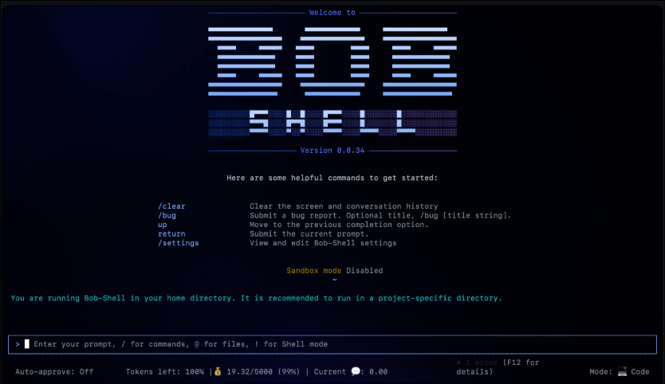

*Figure 19: Bob Shell interactive command line session*

#### Start a non-interactive session

Non-interactive session provides a method to use Bob Shell directly from the command line without entering an interactive session. Use for automation, scripting, and batch processing tasks. Learn more about [starting non-interactive sessions](https://bob.ibm.com/docs/shell/getting-started/start-bobshell-non-interactive).

#### Bob Shell configuration

You can configure Bob Shell to match your workflow preferences. Learn more about [Bob Shell configuration](https://bob.ibm.com/docs/shell/configuration/configuring).

#### Bob Shell tools

Learn how Bob Shell uses specialized tools to read files, edit code, run commands, and interact with your development environment from the command line. Learn more about [Bob Shell tools](https://bob.ibm.com/docs/shell/core-concepts/tools).

#### Bob Shell features

Explore Bob Shell features to enhance your experience and solution building.

- [Slash commands](https://bob.ibm.com/docs/shell/features/slash-commands)

Create custom slash commands to automate workflows and standardize team practices. Learn more about [Slash commands](https://bob.ibm.com/docs/shell/features/slash-commands).

- [Modes](https://bob.ibm.com/docs/shell/features/modes)

Modes are specialized personas that tailor Bob's behavior for your specific tasks. Each mode offers different capabilities and access levels to help you accomplish particular goals more efficiently. Learn more about [Modes](https://bob.ibm.com/docs/shell/features/modes).

#### Bob Shell usage examples

Try practical examples on how to use Bob Shell for debugging, code improvement, file creation, documentation generation, and learning new concepts. Learn more about [Bob Shell usage examples](https://bob.ibm.com/docs/shell/getting-started/bobshell-examples).

### Upload Bob task session summary

**Each participant** must upload all relevant Bob task session summary screenshots as part of your project submission. These screenshots must be included in your **final code repository** as **submission deliverable**.

Follow the steps below to complete this process:

- Create a folder named **bob_sessions** in your project submission code repository.
- In your Bob IDE’s chat interface, select **Tasks** to display the task list.

*Figure 20: Selecting Tasks tab in Bob IDE chat interface*

- Select a task from the list related to your project submission and the selected task will open in the chat panel. Confirm that you are in the correct project workspace. If your submission includes tasks from multiple workspaces, select **All** to view tasks across all relevant workspaces.

*Figure 21: Filtering Tasks across all workspaces (selecting "All")*

- Select the task header. A task session consumption summary will be displayed.

*Figure 22: Selecting task header to reveal session consumption summary*

- Take a screenshot of the task session consumption summary. Save screenshots in **PNG** format where possible for better text clarity. Use a clear file name that includes your team name, task number, and short task description.

**Example**: teamalpha_task01_login_flow_summary.png

*Figure 23: Example task session consumption summary screenshot for bob_sessions/*

- Now, repeat the steps above for all the tasks related to your project submission.
- Upload all task session consumption summary screenshots to the **bob_sessions** folder in your code repository.

> [!IMPORTANT]
> Before submitting your project, ensure that your team final code repository includes the **bob_sessions** folder with all required screenshots relevant to the project solution.

## Appendix: Example use cases

You are not limited to these ideas, but here are several examples for how you could apply IBM Bob, with optional use of watsonx Orchestrate and watsonx.ai, to solve real challenges in this hackathon:

- **Smart developer onboarding assistant**: Help new developers understand and contribute to an unfamiliar codebase faster. Use IBM Bob to analyze repositories, explain architecture, generate setup guidance, and suggest starter tasks. Optionally use watsonx Orchestrate to automate onboarding activities and watsonx.ai to deliver conversational guidance.
- **Intelligent code review and quality coach**: Improve code quality and reduce review effort by using IBM Bob to analyze code changes, identify risks, explain findings, recommend fixes, and generate review summaries. Optionally use watsonx.ai to prioritize findings and watsonx Orchestrate to automate review workflows.
- **Automated testing and validation hub**: Reduce manual testing effort by using IBM Bob to generate unit tests, identify coverage gaps, validate code changes, and suggest improvements. Optionally use watsonx Orchestrate to orchestrate testing workflows and watsonx.ai to analyze test results and risk areas.
- **Release readiness and deployment assistant**: Help teams prepare software releases with confidence. Use IBM Bob to analyze code changes, review dependencies, summarize risks, generate release notes, and validate deployment requirements. Optionally use watsonx Orchestrate to automate release tasks and approvals.
- **Legacy application modernization accelerator**: Help teams understand, document, refactor, and modernize legacy applications. Use IBM Bob to explain existing code, identify modernization opportunities, generate updated components, and reduce migration effort. Optionally use watsonx.ai for impact analysis and watsonx Orchestrate to coordinate modernization workflows.

## Official IBM Bob Documentation Links

- [Create an IBMid](https://www.ibm.com/docs/en/storage-defender/base?topic=in-creating-ibmid)
- [Admin dashboard](https://bob.ibm.com/admin/subscription)
- [Bob IDE installation instructions](https://bob.ibm.com/docs/ide/getting-started/install)
- [Create an IBMid](https://www.ibm.com/account/reg/us-en/signup?formid=urx-19776)
- [Configuring firewall rules for Bob](https://bob.ibm.com/docs/ide/troubleshooting/ts-firewall-rules)
- [best practices guidelines](https://bob.ibm.com/docs/ide/getting-started/best-practices)
- [Chat interface](https://bob.ibm.com/docs/ide/features/chat-interface)
- [Modes](https://bob.ibm.com/docs/ide/features/modes)
- [Custom modes](https://bob.ibm.com/docs/ide/configuration/custom-modes)
- [subagents](https://bob.ibm.com/docs/ide/features/subagents)
- [Auto-approve](https://bob.ibm.com/docs/ide/features/auto-approving-actions)
- [Custom rules](https://bob.ibm.com/docs/ide/configuration/rules)
- [MCP servers](https://bob.ibm.com/docs/ide/configuration/mcp/mcp-in-bob)
- [Ignoring files](https://bob.ibm.com/docs/ide/configuration/bobignore)
- [Context mentions](https://bob.ibm.com/docs/ide/features/context-mentions)
- [Security guidelines](https://bob.ibm.com/docs/ide/security/bob-security-guidance)
- [Bob tips](https://bob.ibm.com/docs/ide/features/bob-tips)
- [Rollback](https://bob.ibm.com/docs/ide/features/rollback)
- [Code actions](https://bob.ibm.com/docs/ide/features/code-actions)
- [Code reviews](https://bob.ibm.com/docs/ide/features/code-reviews)
- [Commit messages](https://bob.ibm.com/docs/ide/features/commit-messages)
- [Pull requests](https://bob.ibm.com/docs/ide/features/pull-requests)
- [Enhance prompt](https://bob.ibm.com/docs/ide/features/enhance-prompt)
- [Literate coding](https://bob.ibm.com/docs/ide/features/literate-coding)
- [Skills](https://bob.ibm.com/docs/ide/features/skills)
- [Quickstart exercise](https://bob.ibm.com/docs/ide/getting-started/quickstart)
- [Travel demo app](https://bob.ibm.com/docs/ide/getting-started/tutorials/introduction)
- [Build agents with Bob /init](https://bob.ibm.com/docs/ide/getting-started/tutorials/start-a-project)
- [Create a commit and pull request with Bob](https://bob.ibm.com/docs/ide/tutorials/create-commit-and-pr)
- [Generate code from comments](https://bob.ibm.com/docs/ide/getting-started/tutorials/generate-code-from-comments)
- [Plan and implement complex features](https://bob.ibm.com/docs/ide/getting-started/tutorials/partner-with-a-coding-agent)
- [Standardize Bob's behavior](https://bob.ibm.com/docs/ide/getting-started/tutorials/standardize-bobs-behavior)
- [Add a custom mode](https://bob.ibm.com/docs/ide/getting-started/tutorials/add-bob-capabilities)
- [Create a new context window](https://bob.ibm.com/docs/ide/getting-started/tutorials/context-window)
- [Modernize a Node.js application](https://bob.ibm.com/docs/ide/tutorials/modernize-nodejs-express-api)
- [Inspect an unfamiliar codebase](https://bob.ibm.com/docs/ide/tutorials/inspect-a-codebase)
- [Generate architecture diagrams](https://bob.ibm.com/docs/ide/tutorials/generate-architecture-diagrams)
- [Audit code and generate reports](https://bob.ibm.com/docs/ide/tutorials/audit-code)
- [Generate secure code with an actor-critic workflow](https://bob.ibm.com/docs/ide/tutorials/generate-secure-code)
- [Using IBM Bob to build watsonx Orchestrate agents and MCP tools](https://developer.ibm.com/tutorials/build-agents-mcp-tools-watsonx-orchestrate-using-bob/)
- [Build agentic workflows programmatically on watsonx Orchestrate using IBM Bob](https://developer.ibm.com/tutorials/build-programmatic-agentic-workflows-watsonx-orchestrate-bob/)
- [Turn BPMN diagrams into production‑ready agents with Bob skills and watsonx Orchestrate](https://developer.ibm.com/tutorials/bpmn-to-agents-bob-skills-watsonx-orchestrate/)
- [Bob Shell installation instructions](https://bob.ibm.com/docs/shell/getting-started/install-and-setup)
- [Bob Shell authentication](https://bob.ibm.com/docs/shell/getting-started/install-and-setup#authentication)
- [starting interactive sessions](https://bob.ibm.com/docs/shell/getting-started/start-bobshell-interactive)
- [starting non-interactive sessions](https://bob.ibm.com/docs/shell/getting-started/start-bobshell-non-interactive)
- [Bob Shell configuration](https://bob.ibm.com/docs/shell/configuration/configuring)
- [Bob Shell tools](https://bob.ibm.com/docs/shell/core-concepts/tools)
- [Slash commands](https://bob.ibm.com/docs/shell/features/slash-commands)
- [Modes](https://bob.ibm.com/docs/shell/features/modes)
- [Bob Shell usage examples](https://bob.ibm.com/docs/shell/getting-started/bobshell-examples)
