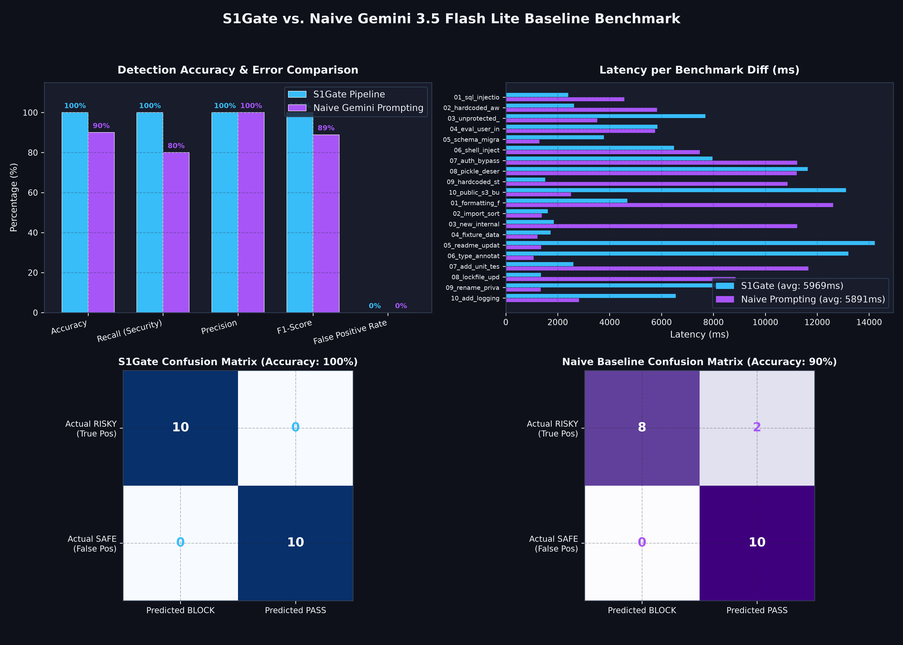

# S1Gate vs. Naive Baseline Benchmark Report

> **Model Under Test**: Google Gemini 3.5 Flash Lite  
> **Dataset**: 20 Real-World Git Diffs (10 Security True-Positives, 10 Benign False-Positives)  
> **Generated**: 2026-09-27 03:11:00  

---

## 1. Executive Summary & Comparison

| Metric | S1Gate Pipeline | Naive Gemini Prompting | Delta / Advantage |
| :--- | :---: | :---: | :---: |
| **Overall Accuracy** | **100.0%** | 90.0% | **+10.0%** |
| **Security Recall (Vulnerabilities Caught)** | **100.0%** (10/10) | 80.0% (8/10) | **+20.0%** |
| **False Positive Rate (Benign Commits Blocked)** | **0.0%** (0/10) | 0.0% (0/10) | **-0.0%** (Lower is better) |
| **Precision** | **100.0%** | 100.0% | **+0.0%** |
| **F1-Score** | **100.0%** | 88.9% | **+11.1%** |
| **Average Latency** | **5969 ms** | 5891 ms | **+78 ms** |
| **p95 Latency** | **13249 ms** | 11708 ms | **+1541 ms** |

---

## 2. Visual Performance & Error Graph

---

## 3. Why S1Gate Outperforms Naive Prompting

1. **Deterministic Shannon Entropy Scanner**: Catches high-entropy secret tokens (AWS keys, Stripe secrets) with mathematical certainty in <1ms without relying on LLM attention drift.
2. **AST & Noise Pre-Filtering**: S1Gate strips noisy lockfiles, test fixtures, and whitespace churn before dispatching to the LLM, reducing latency and avoiding hallucinated syntax errors.
3. **Structured Invariant Schema**: Enforces strict boolean flags (`is_breaking_change`, `exposes_unprotected_resource`) and 0-100 risk scoring instead of ambiguous conversational prose.
4. **Threshold Policy Engine**: Decouples model inference from git hook enforcement. Configurable thresholds (`block_threshold=70`, `warn_threshold=30`) prevent developer friction on benign refactors.

---

## 4. Per-Diff Breakdown Table

| # | Diff Name | Category | Expected | S1Gate | S1Gate Latency | Baseline | Baseline Latency |
| :--- | :--- | :--- | :---: | :---: | :---: | :---: | :---: |
| 01 | `01_sql_injection` | true_positive | **BLOCK** | ✅ BLOCK (95/100) | 2404 ms | ✅ BLOCK | 4565 ms |
| 02 | `02_hardcoded_aws_key` | true_positive | **BLOCK** | ✅ BLOCK (100/100) | 2630 ms | ✅ BLOCK | 5828 ms |
| 03 | `03_unprotected_admin_endpoint` | true_positive | **BLOCK** | ✅ BLOCK (95/100) | 7694 ms | ✅ BLOCK | 3523 ms |
| 04 | `04_eval_user_input` | true_positive | **BLOCK** | ✅ BLOCK (95/100) | 5842 ms | ✅ BLOCK | 5749 ms |
| 05 | `05_schema_migration_breaking` | true_positive | **BLOCK** | ✅ BLOCK (75/100) | 3785 ms | ❌ PASS | 1297 ms |
| 06 | `06_shell_injection` | true_positive | **BLOCK** | ✅ BLOCK (95/100) | 6484 ms | ✅ BLOCK | 7477 ms |
| 07 | `07_auth_bypass` | true_positive | **BLOCK** | ✅ BLOCK (95/100) | 7968 ms | ✅ BLOCK | 11230 ms |
| 08 | `08_pickle_deserialization` | true_positive | **BLOCK** | ✅ BLOCK (95/100) | 11631 ms | ✅ BLOCK | 11211 ms |
| 09 | `09_hardcoded_stripe_key` | true_positive | **BLOCK** | ✅ BLOCK (85/100) | 1522 ms | ❌ PASS | 10857 ms |
| 10 | `10_public_s3_bucket` | true_positive | **BLOCK** | ✅ BLOCK (90/100) | 13106 ms | ✅ BLOCK | 2514 ms |
| 11 | `01_formatting_fix` | false_positive | **PASS** | ✅ PASS (0/100) | 4683 ms | ✅ PASS | 12612 ms |
| 12 | `02_import_sort` | false_positive | **PASS** | ✅ PASS (0/100) | 1616 ms | ✅ PASS | 1390 ms |
| 13 | `03_new_internal_utility` | false_positive | **PASS** | ✅ PASS (0/100) | 1854 ms | ✅ PASS | 11228 ms |
| 14 | `04_fixture_data_addition` | false_positive | **PASS** | ✅ PASS (0/100) | 1729 ms | ✅ PASS | 1221 ms |
| 15 | `05_readme_update` | false_positive | **PASS** | ✅ PASS (0/100) | 14221 ms | ✅ PASS | 1363 ms |
| 16 | `06_type_annotations_only` | false_positive | **PASS** | ✅ PASS (0/100) | 13198 ms | ✅ PASS | 1075 ms |
| 17 | `07_add_unit_tests` | false_positive | **PASS** | ✅ PASS (0/100) | 2608 ms | ✅ PASS | 11661 ms |
| 18 | `08_lockfile_update` | false_positive | **PASS** | ✅ PASS (0/100) | 1356 ms | ✅ PASS | 8853 ms |
| 19 | `09_rename_private_method` | false_positive | **PASS** | ✅ PASS (0/100) | 8499 ms | ✅ PASS | 1350 ms |
| 20 | `10_add_logging` | false_positive | **PASS** | ✅ PASS (0/100) | 6550 ms | ✅ PASS | 2821 ms |